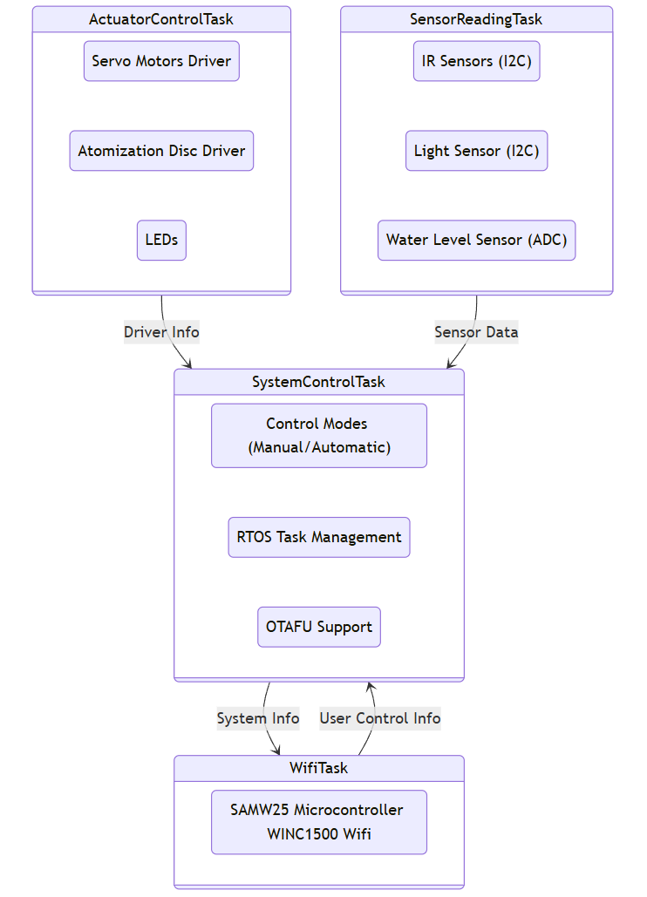
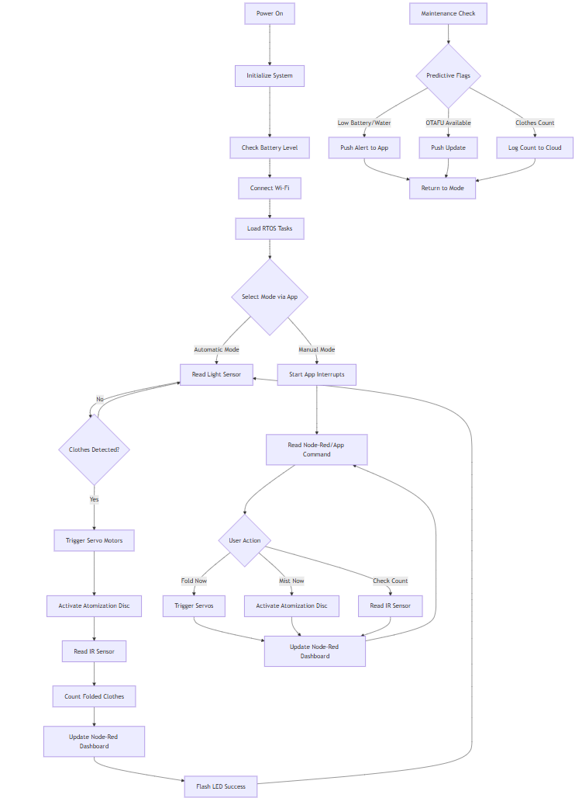
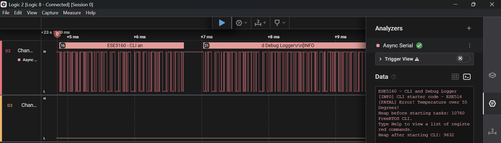

# a07g-exploring-the-CLI

* Team Number: 25
* Team Name: FOLEASY
* Team Members: Sanskriti Binani, Chirag Satapathy
* GitHub Repository URL: https://github.com/ese5160/final-project-a07g-a14g-t25-foldeasy
* Description of test hardware: (development boards, sensors, actuators, laptop + OS, etc)

# 1. Software Architecture

## 1. Updated HRS and SRS

### Hardware Requirements Specification (HRS)

| **ID**   | **Requirement**             | **Description**                                                                                                                                         |
|----------|-----------------------------|---------------------------------------------------------------------------------------------------------------------------------------------------------|
| HRS 01   | Microcontroller              | The system shall use the **SAMW25 microcontroller**, providing **Wi-Fi connectivity with WINC1500** and processing power to control all tasks.                        |
| HRS 02   | Servo Motors                 | The system shall use **servo motors** for precise folding arm control, with a range of motion from **0° to 180°**.                                      |
| HRS 03   | IR Sensors            | The device shall use **IR sensors** for object detection, with a range of **10 cm to 1 meter**.                                       |
| HRS 04   | Wi-Fi Connectivity           | The device shall have **Wi-Fi connectivity** via the **SAMW25 microcontroller**, enabling remote control and monitoring.                                |
| HRS 05   | Atomization Disc               | A **atomization disc** shall be used to release fragrance mist after the folding process is completed.                                                    |
| HRS 06   | Power Supply                 | The system shall be powered by a **rechargeable 3.7V Li-ion battery**, ensuring portability and energy efficiency.                                                   |
| HRS 07   | OTAFU Support                | The device shall support **Over-the-Air Firmware Updates (OTAFU)** to allow easy remote updates without requiring physical access.                       |
| HRS 08   | Water Level Sensor           | The system shall include a **water level sensor** to detect the **mist level** inside the fragrance container. The sensor will help determine when the container needs to be refilled. |
| HRS 09   | Folding Style Modes	         |The system shall provide various folding modes, such as three-fold for shirts, two-fold for t-shirts, and a different fold for pants/jeans.              |

### Software Requirements Specification (SRS)

| **ID**   | **Requirement**             | **Description**                                                                                                                                         |
|----------|-----------------------------|---------------------------------------------------------------------------------------------------------------------------------------------------------|
| SRS 01   | Clothes Detection            | The system shall detect clothes using **light sensor**, triggering the folding process within approximately **200 ms** after detection.                          |
| SRS 02   | Servo Motor Control          | The system shall control **servo motors** using PWM to move the folding arms based on predefined folding actions.                                                  |
| SRS 03   | Fragrance Activation         | The **atomization disc** shall be activated for **3 seconds** after folding to release a fragrance mist.                                                   |
| SRS 04   | Control Modes                | The system shall support **Manual** and **Automatic** modes for user interaction. Manual mode allows the user to directly control the system, while automatic mode detects clothes and starts the folding process automatically. |
| SRS 05   | Wi-Fi Communication          | The system shall allow remote control via **Wi-Fi**, with status updates every **30 seconds** sent to the user's mobile device.                         |
| SRS 06   | RTOS for Real-Time Operation | The system shall run on an **RTOS**, ensuring **real-time task management** for tasks like motor control, sensor reading, and Wi-Fi communication.       |
| SRS 07   | OTAFU                        | The system shall support **Over-the-Air Firmware Updates (OTAFU)**, allowing firmware to be updated remotely.                                            |
| SRS 08   | Water Level Monitoring       | The system shall monitor the **water level sensor** to detect the **mist level** inside the fragrance container. When the water level is too low, the system shall notify the user to refill. |

## 2.  Block diagram outlining the different tasks into which we are dividing the software



## 3.  Flowcharts or state machine diagrams briefly illustrating how each task operates



# 2. Understanding the Starter Code

**1. What does “InitializeSerialConsole()” do? In said function, what is “cbufRx” and “cbufTx”? What type of data structure is it?**

The function InitializeSerialConsole() is responsible for initializing the serial communication console, specifically for handling UART (USART) communication.  
- It initializes Circular Buffers for RX and TX
- Configures USART and Callbacks
- Sets Interrupt Priority for SERCOM4 peripheral (USART)
- Starts the UART read job to continuously receive characters.

cbufRx and cbufTx are structures representing circular buffers used to store incoming and outgoing serial data efficiently. They allow buffering of received (RX) and transmitted (TX) characters without needing to process them immediately.

**2. How are “cbufRx” and “cbufTx” initialized? Where is the library that defines them (please list the \*C file they come from).**

“cbufRx” and “cbufTx” are initialised using the circular_buf_init() function.
```c
cbufRx = circular_buf_init((uint8_t *)rxCharacterBuffer, RX_BUFFER_SIZE);
cbufTx = circular_buf_init((uint8_t *)txCharacterBuffer, TX_BUFFER_SIZE);
```

where, it uses pre-allocated buffers (rxCharacterBuffer and txCharacterBuffer) to store received and transmitted characters. The buffer sizes are specified via RX_BUFFER_SIZE and TX_BUFFER_SIZE.

It is defined in the file - circular_buffer.c circular_buffer.h 

**3. Where are the character arrays where the RX and TX characters are being stored at the end? Please mention their name and size.**
 
The character arrays storing received and transmitted characters are:

```c
char rxCharacterBuffer[RX_BUFFER_SIZE];  // Size: 512 bytes
char txCharacterBuffer[TX_BUFFER_SIZE];  // Size: 512 bytes
```

sizes defined by macros
```c
#define RX_BUFFER_SIZE 512
#define TX_BUFFER_SIZE 512
```

**4. Where are the interrupts for UART character received and UART character sent defined?** 

Defined in configure_usart_callbacks() function in SerialConsole.c

**5. What are the callback functions that are called when:** 
- A character is received? (RX) : 
```c
void usart_read_callback(struct usart_module *const usart_module)
```
- A character has been sent? (TX) : 
```c
void usart_write_callback(struct usart_module *const usart_module)
```

**6. Explain what is being done on each of these two callbacks and how they relate to the cbufRx and cbufTx buffers.**

RX Callback (usart_read_callback)
- Reads the received character.
- Stores it into the circular buffer cbufRx.
- Echoes the character back for the user to see.
- Starts a new read job to keep receiving characters.

TX Callback (usart_write_callback)
- Retrieves the next character from cbufTx.
- Sends it over UART.
- If there are no more characters left, it stops transmission.

**7. Draw a diagram that explains the program flow for UART receive – starting with the user typing a character and ending with how that characters ends up in the circular buffer “cbufRx”. Please make reference to specific functions in the starter code.**


**8. Draw a diagram that explains the program flow for the UART transmission – starting from a string added by the program to the circular buffer “cbufTx” and ending on characters being shown on the screen of a PC (On Teraterm, for example). Please make reference to specific functions in the starter code.**


**9. What is done on the function “startStasks()” in main.c? How many threads are started?**

The StartTasks() function initializes FreeRTOS tasks. It logs the available heap memory before and after starting tasks. It creates one task, vCommandConsoleTask, which handles the command-line interface (CLI). If the task creation fails, an error message is printed. Currently, only one thread (CLI task) is started.

# 3. Debug Logger Module 

```c
void LogMessage(enum eDebugLogLevels level, const char *format, ...)
{
    // Check if the log level is valid and meets or exceeds the current debug level
    if (level >= getLogLevel() && level < N_DEBUG_LEVELS)
    {
	    // Prefix for different log levels
	    const char *levelPrefix[] = {
		    "[INFO] ",    // LOG_INFO_LVL
		    "[DEBUG] ",   // LOG_DEBUG_LVL
		    "[WARNING] ", // LOG_WARNING_LVL
		    "[ERROR] ",   // LOG_ERROR_LVL
		    "[FATAL] ",   // LOG_FATAL_LVL
		    ""            // LOG_OFF_LVL
	    };

	    // Buffer to hold the formatted message
	    char logBuffer[512];
	    
	    // Buffer to hold the full message with prefix
	    char fullMessageBuffer[600];

	    // Create a va_list to handle variable arguments
	    va_list args;
	    va_start(args, format);

	    // Format the message using vsprintf
	    // Note: Be careful with buffer sizes to prevent buffer overflows
	    vsnprintf(logBuffer, sizeof(logBuffer), format, args);

	    // Clean up the va_list
	    va_end(args);

	    // Combine the level prefix with the formatted message
	    snprintf(fullMessageBuffer, sizeof(fullMessageBuffer), "%s%s",
	    levelPrefix[level], logBuffer);

	    // Write the full message to the serial console
	    SerialConsoleWriteString(fullMessageBuffer);
    }
}
```


# 4. Wiretap the convo!

**1 (i). What nets must you attach the logic analyzer to? (Check how the firmware sets up the UART in SerialConsole.c!)**

```c
config_usart.mux_setting = EDBG_CDC_SERCOM_MUX_SETTING;
config_usart.pinmux_pad0 = EDBG_CDC_SERCOM_PINMUX_PAD0;
config_usart.pinmux_pad1 = EDBG_CDC_SERCOM_PINMUX_PAD1;
config_usart.pinmux_pad2 = EDBG_CDC_SERCOM_PINMUX_PAD2;
config_usart.pinmux_pad3 = EDBG_CDC_SERCOM_PINMUX_PAD3;
```

**1 (ii). Where on the circuit board can you attach / solder to?**

Pin PB10 - UART_TX  
Pin PB11 - UART-RX  
Ground

**1 (iii). What are critical settings for the logic analyzer?**


**2. Submit a photo of your hardware connections between the SAMW25 Xplained dev board and the logic analyzer.**


**3. Submit a screenshot of the decoded message.**



**4. Submit a small capture file (i.e., the .sal file) of a wiretapped conversation.**

[text](<A07G_Docs/Session 0.sal>)


# 5. Complete the CLI

```c
// SerialConsole.h

 #include "FreeRTOS.h"
 #include "semphr.h"

 extern SemaphoreHandle_t rxDataAvailableSemaphore;
 ```

```c
// SerialConsole.c
SemaphoreHandle_t rxDataAvailableSemaphore = NULL;
void usart_read_callback(struct usart_module *const usart_module)
{
	    // Put the latest received character into the circular buffer
	    circular_buf_put(cbufRx, latestRx);

	    // Give the semaphore to signal that data is available
	    if (rxDataAvailableSemaphore != NULL)
	    {
		    BaseType_t xHigherPriorityTaskWoken = pdFALSE;
		    xSemaphoreGiveFromISR(rxDataAvailableSemaphore, &xHigherPriorityTaskWoken);
		    
		    // If a higher priority task was woken, request a context switch
		    portYIELD_FROM_ISR(xHigherPriorityTaskWoken);
	    }

	    // Kick off another read job to continuously receive characters
	    usart_read_buffer_job(&usart_instance, (uint8_t *)&latestRx, 1);
}
```

```c
// CliThread.c 
static void FreeRTOS_read(char *character)
{
	 // If semaphore hasn't been created, create it
	 if (rxDataAvailableSemaphore == NULL)
	 {
		 rxDataAvailableSemaphore = xSemaphoreCreateBinary();
	 }

	 // Wait indefinitely for a character to be available
	 if (xSemaphoreTake(rxDataAvailableSemaphore, portMAX_DELAY) == pdTRUE)
	 {
		 // Retrieve the character from the circular buffer
		 int result = SerialConsoleReadCharacter((uint8_t *)character);
		 
		 // Ensure a character was successfully retrieved
		 if (result == -1)
		 {
			 // No character available, this shouldn't happen if semaphore worked correctly
			 *character = '\0';
		 }
	 }
}
```

# 6. Add CLI commands

**1. Commit your functioning CLI code to your GitHub repo and make comments that are in Doxygen style.**

[CLI Commands](<CLI Starter Code/src/CliThread/CliThread.c>)

**2. Submit a link to a video of this functionality in your README.md**

https://drive.google.com/file/d/132HlBVISEmbh2Mz9M1WWnCoypATKykbY/view?usp=sharing
